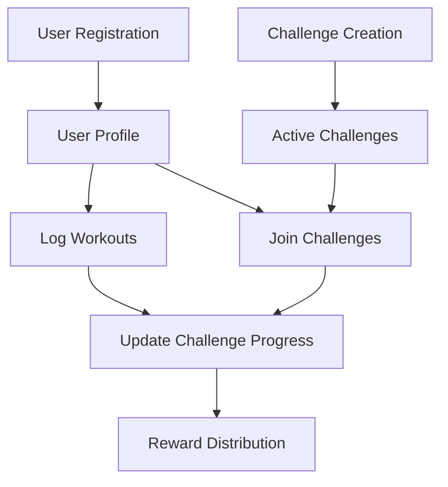

# Shield Living: Fitness Tracking on Blockchain

A decentralized fitness ecosystem that empowers users to securely track workouts, participate in collaborative challenges, and earn community-driven rewards through blockchain technology.

## Overview

FitVault combines fitness tracking with blockchain technology to create a transparent, gamified workout experience. The platform provides:

- Tamper-proof workout records
- Group fitness challenges with verifiable results
- Automated reward distribution for achieving fitness goals
- Social accountability through challenge participation
- Personalized training progress tracking

## Architecture

The FitVault platform is built around a core smart contract that manages user profiles, workout records, and fitness challenges.



### Core Components

1. **User Management**: Handles user registration and profile maintenance
2. **Workout Tracking**: Records and validates workout activities
3. **Challenge System**: Manages creation, participation, and completion of fitness challenges
4. **Reward Mechanism**: Tracks achievement progress and distributes rewards

## Contract Documentation

### fitness-tracker.clar

The core smart contract powering the Shield Living fitness tracking ecosystem.

#### Key Features

- User registration and profile management
- Workout logging with type validation
- Fitness challenge creation and management
- Challenge participation tracking
- Automated progress updates

#### Access Control

- General users can register, log workouts, and join challenges
- Challenge creators can end their own challenges
- Contract owner can add new workout types

## Getting Started

### Prerequisites

- Clarinet
- Stacks wallet for interaction

### Installation

1. Clone the repository
2. Install dependencies with Clarinet
3. Deploy contracts to the Stacks network

### Basic Usage

```clarity
;; Register a new user
(contract-call? .fitvault-core register-user "username")

;; Log a workout
(contract-call? .fitvault-core log-workout "running" u30 u300 none)

;; Create a challenge
(contract-call? .fitvault-core create-challenge 
    "30 Day Running Challenge" 
    "Complete 20 runs in 30 days" 
    u100 u130 u20 u15 u1000)

;; Join a challenge
(contract-call? .fitvault-core join-challenge u1)
```

## Function Reference

### Public Functions

#### `register-user`
```clarity
(define-public (register-user (username (string-utf8 50))))
```
Creates a new user profile.

#### `log-workout`
```clarity
(define-public (log-workout 
    (workout-type (string-utf8 20)) 
    (duration-minutes uint) 
    (calories-burned uint) 
    (notes (optional (string-utf8 200)))))
```
Records a new workout activity.

#### `create-challenge`
```clarity
(define-public (create-challenge 
    (name (string-utf8 100)) 
    (description (string-utf8 500))
    (start-date uint)
    (end-date uint)
    (workout-goal uint)
    (min-workout-duration uint)
    (reward-amount uint)))
```
Creates a new fitness challenge.

#### `join-challenge`
```clarity
(define-public (join-challenge (challenge-id uint)))
```
Joins an existing fitness challenge.

### Read-Only Functions

#### `get-user-profile`
```clarity
(define-read-only (get-user-profile (user principal)))
```
Retrieves user profile information.

#### `get-workout`
```clarity
(define-read-only (get-workout (workout-id uint) (user principal)))
```
Retrieves details of a specific workout.

#### `get-challenge`
```clarity
(define-read-only (get-challenge (challenge-id uint)))
```
Retrieves details of a specific challenge.

## Development

### Testing

Run tests using Clarinet:

```bash
clarinet test
```

### Local Development

1. Start a local Clarinet console:
```bash
clarinet console
```

2. Deploy contracts:
```bash
clarinet deploy
```

## Security Considerations

### Limitations

- One workout record per day per user
- Challenge participation requires active user profile
- Challenge rewards are fixed at creation

### Best Practices

1. Always verify challenge parameters before joining
2. Ensure workout data is accurate before submission
3. Monitor challenge end dates to claim rewards
4. Verify transaction success for all operations

### Data Validation

- Workout types must be pre-approved
- Duration and calorie counts must be positive values
- Challenge dates must be logical and in the future
- Username length is limited to 50 characters